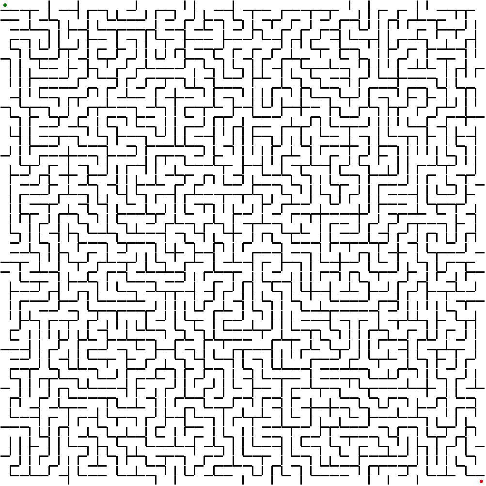
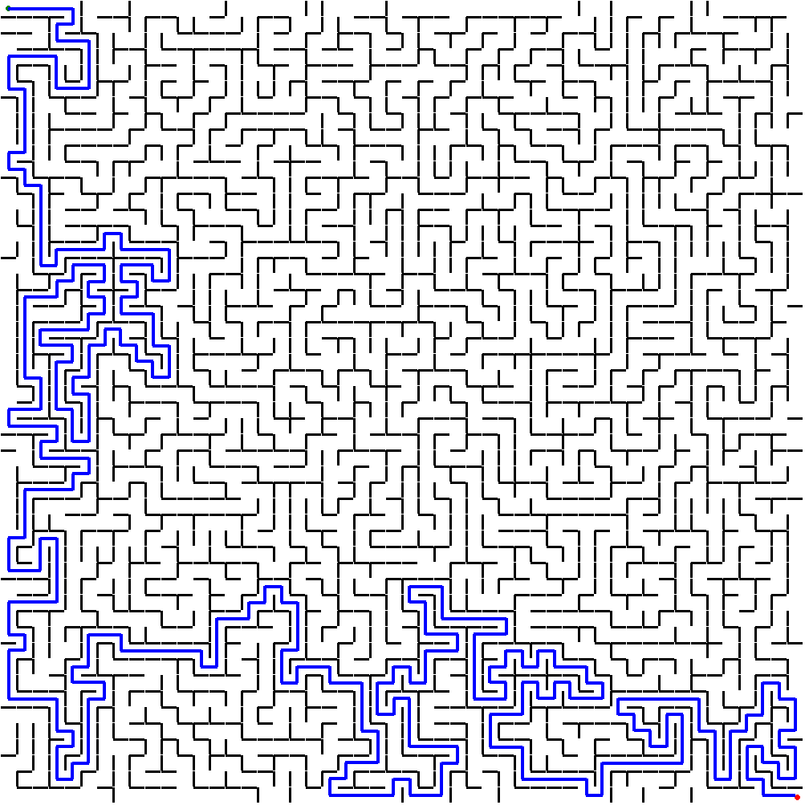
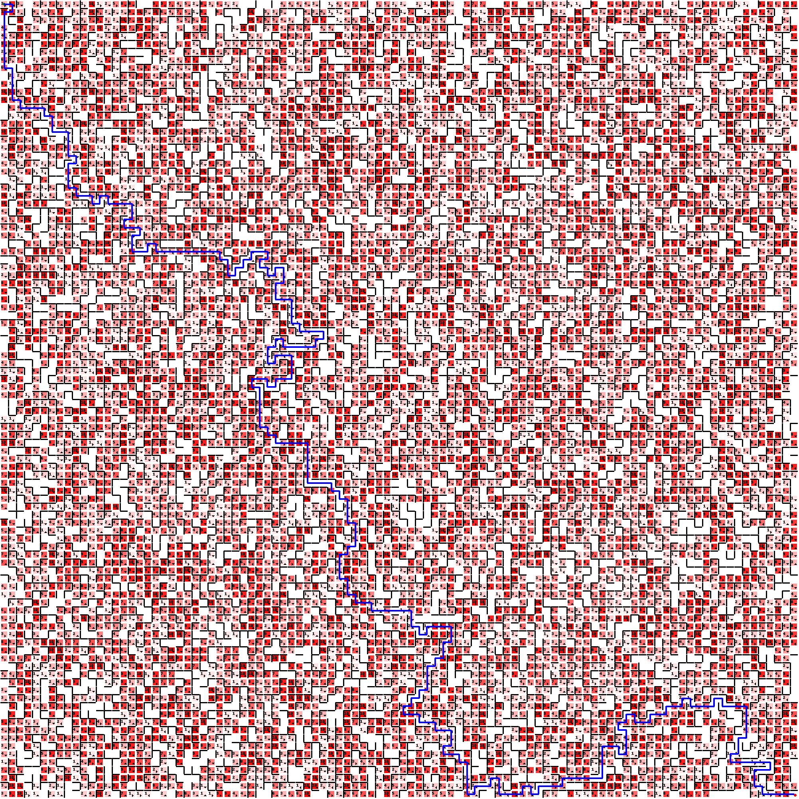

# Maze Solver FastAPI

This FastAPI app uses path finding algorithms to create and solve mazes while allowing for strict pathing and accounting for weighted cells.

This [`repository`](https://github.com/velajua/maze_solver) contains the necessary files to daploy a containerized app using Docker which is able to create mazes using a modified version of the Breadth-First-Search algorithm, as well as solutions to the generated mazes using various path-finding algorithms which can be found below.

## Requirements

* Python 3.6+
* FastAPI
* uvicorn

## How to Run

1. Clone this repository.
2. Install the requirements using `pip install -r requirements.txt`.
3. Run the app using the following command: `uvicorn maze_app:app --reload`.
4. Navigate to `http://localhost:8000` in your web browser.
5. Generate maze files usign the form provided in `/maze_generator`.
6. Upload a maze file and select a pathing algorithm to see the solution in `/upload_maze`.

### Docker local

1. Clone this repository.
2. Build the container using the following command: `docker build -t maze_solver .`. [//]: # (docker tag maze_solver velajua/maze_solver:latest)
3. Run the container using the following command: `docker run -it -p 8000:8000 maze_solver`.
4. Navigate to `http://localhost:8000` in your web browser.
5. Generate maze files usign the form provided in `/maze_generator`.
6. Upload a maze file and select a pathing algorithm to see the solution in `/upload_maze`.

### Docker

1. Pull the image from Dockerhub: `docker pull velajua/maze_solver:latest`
2. Run the container using the following command: `docker run -it -p 8000:8000 maze_solver`.
3. Navigate to `http://localhost:8000` in your web browser.
4. Generate maze files usign the form provided in `/maze_generator`.
5. Upload a maze file and select a pathing algorithm to see the solution in `/upload_maze`.

## Usage

### A full demo can be found [`here`](https://maze-solver-4r64swfrtq-uc.a.run.app)

## Maze Endpoints

`http://localhost:8000/maze_generator` to generate the maze files.

The maze generator can make various mazes, taking parameters for how strict the pathing is, and the probability of having weighted cells.
A Demo of the maze_generator can be found [`here`](https://maze-solver-4r64swfrtq-uc.a.run.app/maze_generator)

`http://localhost:8000/upload_maze` to solve the maze file using a pathing algorithm.
Using Djikstra, the following solution can be obtained.

A Demo of the maze_solver can be found [`here`](https://maze-solver-4r64swfrtq-uc.a.run.app/upload_maze)

-------------------------------------------------------------------------------------------

This is an example of a heavily weighted 100x100 maze:
Its solution along with the cost fo the solution from coordinates (0, 0) to coordinates (99, 99) is as follows:
{'path': [(0, 0), (1, 0), (1, 1), (0, 1), (0, 2), (0, 3), (0, 4), (0, 5), (0, 6), (0, 7), (0, 8), (1, 8), (1, 9), (1, 10), (1, 11), (1, 12), (2, 12), (2, 13), (3, 13), (4, 13), (5, 13), (5, 14), (6, 14), (6, 15), (6, 16), (7, 16), (8, 16), (8, 17), (8, 18), (8, 19), (9, 19), (9, 20), (8, 20), (8, 21), (8, 22), (8, 23), (9, 23), (9, 24), (10, 24), (11, 24), (11, 25), (12, 25), (12, 24), (13, 24), (13, 25), (14, 25), (15, 25), (16, 25), (16, 26), (16, 27), (15, 27), (15, 28), (16, 28), (17, 28), (17, 29), (16, 29), (16, 30), (16, 31), (17, 31), (18, 31), (18, 30), (19, 30), (19, 31), (20, 31), (21, 31), (22, 31), (23, 31), (24, 31), (25, 31), (26, 31), (27, 31), (27, 32), (28, 32), (28, 33), (28, 34), (29, 34), (29, 33), (30, 33), (30, 32), (31, 32), (31, 31), (32, 31), (33, 31), (33, 32), (32, 32), (32, 33), (33, 33), (33, 34), (34, 34), (34, 33), (35, 33), (35, 34), (35, 35), (34, 35), (34, 36), (34, 37), (35, 37), (36, 37), (36, 38), (36, 39), (36, 40), (37, 40), (37, 41), (38, 41), (39, 41), (40, 41), (40, 42), (39, 42), (39, 43), (38, 43), (37, 43), (36, 43), (35, 43), (35, 42), (34, 42), (34, 43), (33, 43), (33, 44), (33, 45), (34, 45), (34, 44), (35, 44), (36, 44), (36, 45), (36, 46), (36, 47), (35, 47), (34, 47), (34, 48), (33, 48), (33, 47), (32, 47), (31, 47), (31, 48), (32, 48), (32, 49), (32, 50), (32, 51), (32, 52), (32, 53), (33, 53), (33, 54), (34, 54), (34, 55), (35, 55), (36, 55), (37, 55), (38, 55), (38, 56), (38, 57), (38, 58), (38, 59), (38, 60), (39, 60), (40, 60), (41, 60), (41, 61), (42, 61), (42, 62), (43, 62), (43, 63), (43, 64), (43, 65), (44, 65), (44, 66), (44, 67), (44, 68), (43, 68), (43, 69), (42, 69), (42, 70), (42, 71), (42, 72), (43, 72), (43, 73), (43, 74), (44, 74), (44, 75), (45, 75), (46, 75), (46, 76), (47, 76), (48, 76), (49, 76), (50, 76), (51, 76), (51, 77), (51, 78), (52, 78), (52, 79), (53, 79), (53, 78), (54, 78), (55, 78), (56, 78), (56, 79), (56, 80), (55, 80), (55, 81), (55, 82), (54, 82), (54, 83), (53, 83), (53, 84), (53, 85), (53, 86), (52, 86), (52, 87), (51, 87), (51, 88), (50, 88), (50, 89), (51, 89), (52, 89), (52, 90), (53, 90), (54, 90), (54, 91), (55, 91), (56, 91), (56, 92), (56, 93), (55, 93), (55, 94), (56, 94), (57, 94), (57, 95), (58, 95), (58, 96), (58, 97), (58, 98), (58, 99), (59, 99), (59, 98), (60, 98), (61, 98), (61, 97), (62, 97), (62, 98), (62, 99), (63, 99), (64, 99), (65, 99), (65, 98), (66, 98), (66, 99), (67, 99), (67, 98), (68, 98), (69, 98), (70, 98), (70, 97), (71, 97), (72, 97), (73, 97), (74, 97), (75, 97), (75, 96), (75, 95), (75, 94), (75, 93), (76, 93), (77, 93), (77, 94), (78, 94), (78, 93), (78, 92), (78, 91), (77, 91), (77, 90), (78, 90), (78, 89), (79, 89), (79, 90), (80, 90), (81, 90), (81, 89), (82, 89), (83, 89), (83, 88), (84, 88), (85, 88), (85, 87), (86, 87), (86, 88), (87, 88), (88, 88), (89, 88), (89, 87), (90, 87), (90, 88), (91, 88), (92, 88), (93, 88), (93, 89), (93, 90), (93, 91), (93, 92), (92, 92), (92, 93), (92, 94), (91, 94), (91, 95), (92, 95), (93, 95), (94, 95), (95, 95), (96, 95), (96, 96), (95, 96), (94, 96), (94, 97), (94, 98), (95, 98), (95, 99), (96, 99), (97, 99), (98, 99), (99, 99)], 'cost': 584}

## Supported Algorithms

The maze_solver currently supports the following maze solving algorithms (Which can be found in [`here`](path_finding.py):

* Dijkstra's Algorithm

    - The algorithm works by maintaining a set of tentative distances from the start node to each node in the graph. Initially, all distances are set to infinity, except the distance to the start node, which is set to 0. A priority queue is used to store the nodes and their tentative distances. In each iteration, the algorithm selects the node with the smallest tentative distance from the priority queue and explores its neighbors. For each neighbor, if the path through the current node is shorter than the current tentative distance, the neighbor's tentative distance is updated and the path is added to the priority queue. The algorithm continues until the destination node is reached or the priority queue is empty.

    - The time complexity of Dijkstra's algorithm is O(E + V log V), where E is the number of edges and V is the number of vertices in the graph. The implementation above uses a priority queue to efficiently select the node with the smallest tentative distance, which gives it a time complexity of O(E log V).

* A* Algorithm

    - The algorithm works by maintaining two sets of nodes: the "frontier" and the "visited" set. The frontier contains the nodes that have been discovered but not yet explored, while the visited set contains the nodes that have been explored. Initially, only the start node is in the frontier, and its cost is set to 0. In each iteration, the algorithm selects the node in the frontier with the lowest cost (i.e., the sum of the actual cost from the start node and the estimated cost to the goal node) and explores its neighbors. For each neighbor, if it is not in the visited set, its cost is updated if the new path through the current node is shorter than the previous one. The neighbor is then added to the frontier with its updated cost, and its parent node is recorded in the "came_from" dictionary. The algorithm terminates when the goal node is added to the visited set, at which point the shortest path from the start to the goal node is reconstructed using the "came_from" dictionary.

    - The time complexity of A* algorithm depends on the quality of the heuristic function used. In the worst case, it can be O(b^d), where b is the branching factor of the graph and d is the depth of the goal node. However, in practice, a good heuristic function can significantly reduce the search space and lead to much faster convergence. The implementation above uses a Manhattan distance heuristic function by default, which estimates the distance between two nodes as the sum of their absolute differences in their x and y coordinates. The time complexity of the implementation is O(E log V), where E is the number of edges and V is the number of vertices in the graph. This is because the implementation uses a priority queue to store the frontier, which takes O(log V) time to insert and remove elements, and each node can be added to the frontier at most once.

* Breadth-First Search

    - The algorithm works by maintaining two sets of nodes: the "frontier" and the "visited" set. The frontier contains the nodes that have been discovered but not yet explored, while the visited set contains the nodes that have been explored. Initially, only the start node is in the frontier, and its cost is set to 0. In each iteration, the algorithm selects the next node in the frontier and explores all its neighbors. For each neighbor, if it has not been visited before, it is added to the frontier with its cost updated if the new path through the current node is shorter than the previous one. The algorithm continues until the goal node is visited or the frontier is empty.

    - The time complexity of BFS algorithm is O(E + V), where E is the number of edges and V is the number of vertices in the graph. This is because each edge is examined at most twice (once for each of its endpoints), and each vertex is added to the frontier at most once. The implementation above uses a deque data structure to store the frontier, which allows for efficient appending and popping of elements from both ends. Therefore, the time complexity of the implementation is also O(E + V).

* Depth-First Search

    - The algorithm works by maintaining a stack of nodes to be explored. Initially, the start node is added to the stack. In each iteration, the algorithm selects the next node from the stack and explores all its neighbors. For each unexplored neighbor, it is added to the stack with the cost updated if the new path through the current node is shorter than the previous one. The algorithm continues until the goal node is found or the stack is empty. Once the goal node is found, the algorithm reconstructs the path from the start node to the goal node using the "came_from" dictionary, which stores the parent node and the edge cost for each node in the path. Starting from the goal node, the algorithm follows the parent nodes and accumulates the total cost of the path. Finally, the path is reversed to obtain the correct order of nodes.

    - The time complexity of DFS algorithm is also O(E + V), where E is the number of edges and V is the number of vertices in the graph. However, DFS is generally less efficient than BFS because it may explore many unnecessary paths before finding the goal node. The implementation above uses a stack data structure to store the nodes to be explored, which may lead to a worst-case space complexity of O(V) if the graph has a large depth.

* Bellman-Ford Algorithm

    - The bellman_ford function is an implementation of the Bellman-Ford algorithm, which is used to find the shortest paths from a source vertex to all other vertices in a weighted directed graph with possibly negative edge weights. The algorithm works by relaxing edges repeatedly and updating the distance to each vertex until the shortest path is found. If the graph contains a negative-weight cycle, then the algorithm can detect it and raise an error.

    - The time complexity of the Bellman-Ford algorithm is O(VE), where V is the number of vertices and E is the number of edges in the graph. The algorithm relaxes all edges in each of V-1 iterations, and each relaxation takes O(E) time. In the worst case, the algorithm may need to repeat the relaxation process V-1 times, leading to the O(VE) time complexity.

* Bidirectional Search

    - The algorithm simultaneously performs a breadth-first search from the start node and a breadth-first search from the goal node, until the two searches meet at some intersection node. At this point, the algorithm returns the shortest path found by combining the path from the start node to the intersection node with the path from the intersection node to the goal node.

    - The time complexity of the bidirectional search algorithm is generally better than that of the unidirectional search algorithms, since it simultaneously searches from both the start and goal nodes. The time complexity of the algorithm depends on the branching factor of the graph, and can be expressed as O(b^(d/2)), where b is the branching factor and d is the depth of the shortest path between start and goal. This can be much faster than the O(b^d) time complexity of the unidirectional search algorithms, especially for large graphs with high branching factors. However, the space complexity of the algorithm is higher, since it requires storing two sets of search data structures.

* Beam Search

    - The idea behind Beam Search is similar to Breadth-First Search, but with a key difference: it limits the number of nodes expanded at each level. Instead of expanding all neighbors of the current node, Beam Search selects only a fixed number (the beam width) of the most promising nodes according to some heuristic. In this implementation, the function maintains a set of visited nodes to avoid revisiting nodes, and uses a priority queue (implemented as a list sorted by cost) to keep track of the most promising paths. At each iteration, it pops the lowest-cost path from the queue, expands its last node to generate new paths, and adds those paths to the queue, up to a maximum of beam_width. If the goal node is reached, the function returns the path and its cost. Otherwise, it returns None if there are no more paths in the queue.

    - The time complexity of Beam Search depends on the branching factor b, the depth of the goal node d, and the beam width w. The worst-case time complexity is O(b^d), which is the same as Breadth-First Search. However, in practice, Beam Search tends to perform better than Breadth-First Search because it expands fewer nodes, especially when the beam width is small. The space complexity is also proportional to the number of nodes expanded, which is limited by the beam width.
