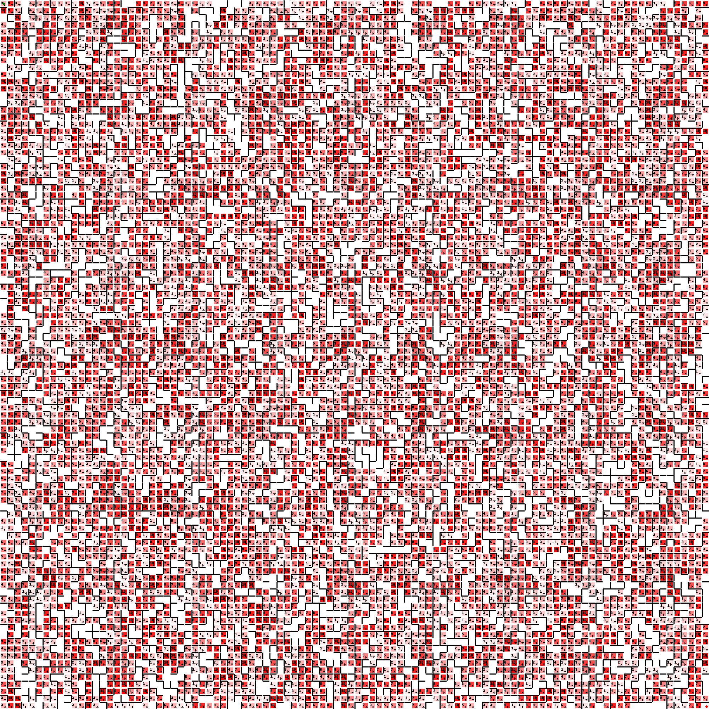

# Maze Solver FastAPI

This FastAPI app creates and solves mazes using various algorithms.

## Requirements

* Python 3.6+
* FastAPI
* uvicorn

## How to Run

1. Clone this repository.
2. Install the requirements using `pip install -r requirements.txt`.
3. Run the app using the following command: `uvicorn maze_app:app --reload`.
4. Navigate to `http://localhost:8000` in your web browser.
5. Generate maze files usign the form provided in `/maze_generator`.
6. Upload a maze file and select a pathing algorithm to see the solution in `/uploud_maze`.

### containerized

1. Clone this repository.
2. Build the container using the following command: `docker build -t maze_solver .`.
3. Run the container using the following command: `docker run -it -p 8000:8000 maze_solver`.
4. Navigate to `http://localhost:8000` in your web browser.
5. Generate maze files usign the form provided in `/maze_generator`.
6. Upload a maze file and select a pathing algorithm to see the solution in `/uploud_maze`.

## Usage

`http://localhost:8000/maze_generator` to generate the maze files.

The maze generator can make various mazes, taking parameters for how strict the pathing is, and the probability of having weighted cells.

`http://localhost:8000/upload_maze` to solve the maze file using a pathing algorithm.

Using Djikstra, the following solution can be obtained.

Heavily weighted maze:

## Supported Algorithms

The app currently supports the following maze solving algorithms (Which can be found in [`here`](path_finding.py):

* Dijkstra's Algorithm
* A* Algorithm
* Breadth-First Search
* Depth-First Search
* Bellman-Ford Algorithm
* Bidirectional Search
* Beam Search
